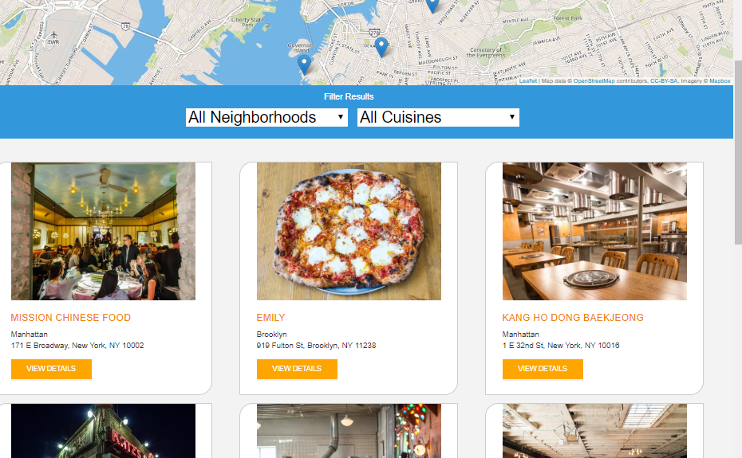
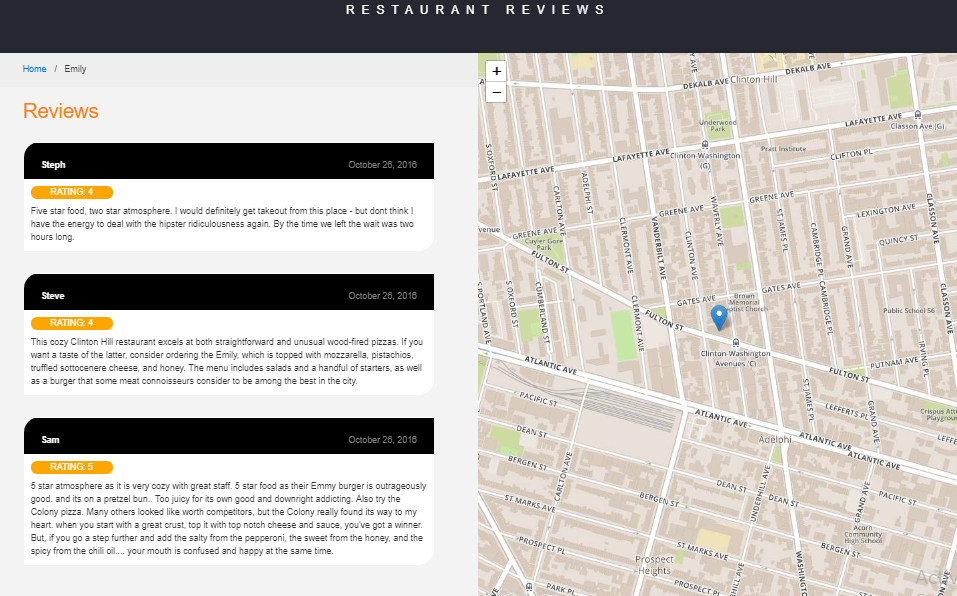

# Mobile Web Specialist Certification Course

## ## Getting Started

* Download/Clone the code
* In a terminal, check the version of Python you have: `python -V`. If you have Python 2.x, spin up the server with `python -m SimpleHTTPServer 8000` (or some other port, if port 8000 is already in use.) For Python 3.x, you can use `python3 -m http.server 8000`. If you don't have Python installed, navigate to Python's [website](https://www.python.org/) to download and install the software.
* For Windows systems, Python 3.x is installed as `python` by default. To start a Python 3.x server, you can simply enter `python -m http.server 8000`.
* With your server running, visit the site: `http://localhost:8000`

## Dependencies

* This repository uses [leafletjs](https://leafletjs.com/) with [Mapbox](https://www.mapbox.com/). Mapbox is free to use, and does not require any payment information.
* [normalize.css ](https://code.google.com/archive/p/normalize-css/): a customisable CSS file that makes browsers render all elements more consistently and in line with modern standards

## Screenshots

### Note about ES6

Most of the code in this project has been written to the ES6 JavaScript specification for compatibility with modern web browsers and future-proofing JavaScript code. As much as possible, try to maintain use of ES6 in any additional JavaScript you write.
